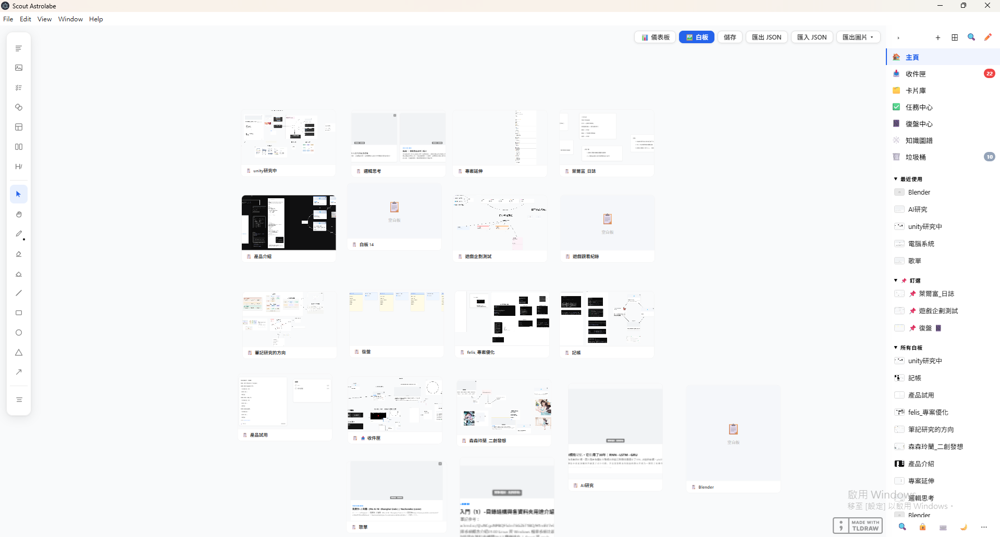
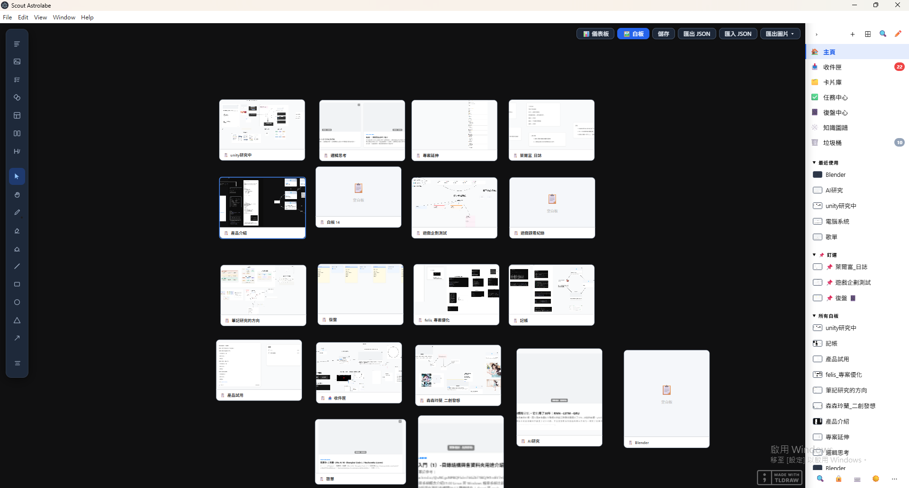
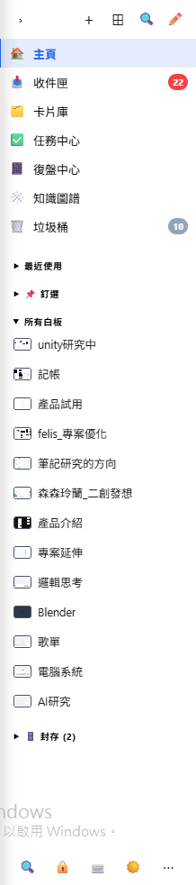

# 🚀 Scout Astrolabe

一個受 Milanote 啟發的 Windows 桌面白板應用程式，使用 React + Electron + tldraw 建構。


---

## 📖 目錄

- [主要功能](#-主要功能)
- [截圖展示](#-截圖展示)
- [快速開始](#-快速開始)
- [系統需求](#-系統需求)
- [安裝指南](#-安裝指南)
- [使用說明](#-使用說明)
- [鍵盤快捷鍵](#-鍵盤快捷鍵)
- [技術架構](#-技術架構)
- [開發指南](#-開發指南)
- [常見問題](#-常見問題)
- [開發路線圖](#-開發路線圖)
- [貢獻指南](#-貢獻指南)
- [授權資訊](#-授權資訊)
- [致謝](#-致謝)

---

## ✨ 主要功能

### 📝 豐富的卡片類型

#### 1. 文字卡片
- ✍️ 富文本編輯器（TipTap）
- **粗體**、*斜體*、<u>底線</u>
- 標題（H1-H2）、項目符號清單、編號清單
- 程式碼區塊（語法高亮）
- 6 種文字顏色
- 全螢幕編輯 Modal
- `[[卡片名稱]]` 雙向連結語法 + 自動補全

#### 2. 圖片卡片
- 🖼️ 支援格式：JPG、PNG、GIF、WebP、SVG
- 雙擊全螢幕預覽 / 下載 / 新分頁開啟
- Ctrl+V 貼上圖片自動建立

#### 3. 待辦卡片
- ✅ 勾選式清單，動態新增/刪除項目
- 即時進度統計
- 到期日設定，逾期自動顯示 badge 警示

#### 4. 連結卡片
- 🔗 支援一般網址
- 🎬 YouTube（含 Shorts）、Vimeo、Bilibili 嵌入播放

#### 5. Board 卡片（子白板）
- 📋 雙擊進入子白板
- 縮圖預覽、麵包屑導航
- 支援無限層級巢狀

#### 6. Journal 卡片（每日筆記）
- 📔 每日自動在 Journal 白板建立日記卡片
- 週回顧卡片（每週自動建立 `week-YYYY-WW`）
- 紫色週回顧範本：完成、學習、卡住、目標、待跟進

#### 7. 欄位（Frame 容器）
- 📊 tldraw 內建 Frame，卡片可自由拖入拖出

---

### 🎨 視覺設計

- **9 種卡片顏色主題**（無、紅、橙、黃、綠、藍、紫、粉、深色）
- **亮色 / 暗色模式**切換，設定自動記憶
- **卡片屬性列**：狀態（待辦 / 進行中 / 完成）、優先度（低 / 中 / 高）、標籤
- **卡片徽章**：非編輯模式顯示狀態 Badge 與優先度圓點

---

### 🛠️ 核心功能

| 功能 | 說明 |
|------|------|
| ⚡ 自動儲存 | 500ms 防抖，IndexedDB 持久化 |
| 🔍 全域搜尋 | 跨白板搜尋所有卡片（Ctrl+F） |
| 🔗 雙向連結 | `[[名稱]]` 語法 + BacklinksPanel 顯示引用 |
| ✅ 任務中心 | 彙整所有白板的待辦任務，依急迫度分組，逾期自動提醒 |
| 🔍 篩選面板 | 按 status / priority / tag 篩選卡片 |
| 📔 復盤中心 | 週回顧面板，本週統計（卡片數、完成待辦、知識連結） |
| 🕸️ 知識圖譜 | 視覺化呈現白板與卡片的連結關係 |
| ✏️ 快速捕捉 | Ctrl+Space 快速把想法丟進收件匣，之後再整理 |
| 📥 收件匣 | 專屬白板作為未分類卡片的暫存區 |
| 🔒 自動備份 | 切換白板 / 關閉 App 時自動備份，最多保留 30 份，可還原 |
| 📤 匯出 | PNG / PDF（整個白板或選取卡片），完全離線 |
| 📋 Ctrl+V 貼上 | 支援圖片與網址自動建立卡片 |
| 🖱️ 右鍵選單 | 白板空白處右鍵快速建立各類型卡片 |
| 📦 卡片跨白板移動 | 右鍵卡片 → 移動至其他白板 |
| 🏷️ 白板管理 | 釘選、封存、拖曳排序、設為子板 |
| 🌟 新手導覽 | 首次啟動自動顯示，可從設定重新觀看 |
| 💾 本機儲存 | 完全離線，不需帳號，資料不上傳 |

---

## 📸 截圖展示

> 截圖存放於 `docs/screenshots/`，如需新增請依下方說明操作：
>
> 1. 執行 `npm run electron-dev` 啟動應用程式
> 2. 建立幾張卡片後，按下 `Win + Shift + S`（Windows 截圖工具）或使用 ShareX 等截圖軟體
> 3. 依序儲存為：
>    - `docs/screenshots/screenshot-1-whiteboard.png`（主要白板，有卡片的狀態）
>    - `docs/screenshots/screenshot-2-dark.png`（暗色模式，點側邊欄 🌙 切換）
>    - `docs/screenshots/screenshot-3-sidebar.png`（側邊欄展開狀態）

### 主要白板


### 暗色模式


### 側邊欄與白板管理


---

## 🚀 快速開始

### 方法 1：下載安裝檔（一般使用者）

1. 前往 [Releases](https://github.com/player200250/Scout-Astrolabe-master/releases) 頁面
2. 下載最新版本的 `Scout-Astrolabe-Setup-1.0.0.exe`
3. 執行安裝程式
4. 完成安裝後從開始選單啟動

### 方法 2：從原始碼執行（開發者）

```bash
# 1. 複製專案
git clone https://github.com/player200250/Scout-Astrolabe-master.git
cd Scout-Astrolabe-master

# 2. 安裝依賴
npm install

# 3. 啟動 Electron 開發模式
npm run electron-dev
```

---

## 🖥️ 系統需求

### 最低需求

| 項目 | 需求 |
|------|------|
| 作業系統 | Windows 10 (64-bit) 或更新版本 |
| 處理器 | Intel/AMD 雙核心處理器 |
| 記憶體 | 512 MB RAM |
| 硬碟空間 | 200 MB 可用空間 |
| 螢幕解析度 | 1280 × 720 或更高 |

### 建議配置

| 項目 | 建議 |
|------|------|
| 作業系統 | Windows 11 |
| 處理器 | Intel/AMD 四核心處理器或更好 |
| 記憶體 | 2 GB RAM 或更多 |
| 硬碟空間 | 500 MB 可用空間 |
| 螢幕解析度 | 1920 × 1080 或更高 |

---

## 📦 安裝指南

### 標準安裝

1. **下載安裝檔**
   - 前往 [Releases](https://github.com/player200250/Scout-Astrolabe-master/releases)
   - 下載 `Scout-Astrolabe-Setup-1.0.0.exe`

2. **執行安裝程式**
   - 雙擊下載的 `.exe` 檔案
   - Windows 可能會顯示「Windows 已保護您的電腦」警告
   - 點擊「詳細資訊」→「仍要執行」

3. **完成安裝**
   - 安裝完成後可選擇立即啟動
   - 或從開始選單 / 桌面捷徑啟動

### 解除安裝

1. 開啟 Windows 設定（Win + I）
2. 前往「應用程式」→「應用程式與功能」
3. 找到「Scout Astrolabe」→「解除安裝」

**注意**：解除安裝不會刪除您的資料，資料位於 `%APPDATA%\Scout-Astrolabe\`

---

## 📖 使用說明

### 建立卡片

| 方式 | 說明 |
|------|------|
| 白板空白處右鍵 | 選擇要建立的卡片類型 |
| 鍵盤快捷鍵 | `N` 文字、`T` 待辦、`L` 連結、`I` 圖片 |
| Ctrl+Space | 快速捕捉文字到收件匣 |
| Ctrl+V | 貼上圖片或網址自動建立卡片 |

### 白板管理

- **新增白板**：側邊欄頂部「+」按鈕
- **重新命名**：雙擊白板名稱，或右鍵 → 重新命名
- **釘選 / 封存**：白板名稱右鍵選單
- **設為子板**：右鍵 → 設為子板，支援無限層級
- **拖曳排序**：側邊欄拖住白板名稱上下拖動

### 收件匣

未分類的想法先放收件匣（側邊欄 📥 或 Ctrl+Shift+I），之後再整理到對應白板。

### 快速捕捉

按 `Ctrl+Space` 彈出快速輸入框，直接把想法丟進收件匣，不打斷當前工作流程。

### Journal 白板

1. 在任意白板右鍵 → **設為 Journal 白板**
2. 每次進入時自動建立當日卡片（黃色）＋待辦卡片（藍色）
3. 每週第一次進入時自動建立週回顧卡片（紫色）
4. 點側邊欄「📔」開啟復盤中心查看本週統計

### 知識圖譜

點側邊欄「🕸️」或按 `Ctrl+Shift+G`，以節點圖形式呈現所有白板與 `[[連結]]` 的關係。

### 備份與還原

1. 點側邊欄「🔒」開啟備份記錄
2. 切換白板 / 關閉 App 時自動建立備份（每 5 分鐘最多一次）
3. 最多保留 30 份備份
4. 點「還原」並確認即可回復到任意備份時間點

### 雙向連結

在文字或 Journal 卡片中輸入 `[[白板名稱]]`，自動補全並建立連結。
卡片底部的 BacklinksPanel 顯示所有指向該卡片的引用。

### 匯出

點擊右上角「匯出圖片 ▾」，選擇：
- 🖼️ 整個白板 → PNG
- 🖼️ 選取卡片 → PNG
- 📄 整個白板 → PDF
- 📄 選取卡片 → PDF

---

## ⌨️ 鍵盤快捷鍵

### 編輯

| 快捷鍵 | 功能 |
|--------|------|
| `Ctrl+Z` | 復原 |
| `Ctrl+Shift+Z` 或 `Ctrl+Y` | 重做 |
| `Ctrl+A` | 全選 |
| `Ctrl+C` | 複製 |
| `Ctrl+V` | 貼上（支援圖片 / 網址） |
| `Ctrl+D` | 複製選取卡片 |
| `Delete` | 刪除選取 |
| `Esc` | 取消選取 / 回到選取工具 |

### 建立卡片

| 快捷鍵 | 功能 |
|--------|------|
| `N` | 新增文字卡片 |
| `T` | 新增待辦清單 |
| `L` | 新增連結卡片 |
| `I` | 新增圖片卡片 |

### 工具

| 快捷鍵 | 功能 |
|--------|------|
| `V` | 選取工具 |
| `H` | 手掌工具（平移） |
| `A` | 箭頭工具 |
| `E` | 橡皮擦 |
| `P` | 畫筆工具 |

### 檢視

| 快捷鍵 | 功能 |
|--------|------|
| `Ctrl++` | 放大 |
| `Ctrl+-` | 縮小 |
| `Ctrl+0` | 重置縮放 100% |
| `Ctrl+Shift+F` | 縮放至全部 / 縮放至選取 |

### 移動選取的卡片

| 快捷鍵 | 功能 |
|--------|------|
| `↑ ↓ ← →` | 微移 1px |
| `Shift+↑ ↓ ← →` | 微移 10px |

### 面板與導航

| 快捷鍵 | 功能 |
|--------|------|
| `Ctrl+F` | 搜尋卡片 |
| `Ctrl+Space` | 快速捕捉到收件匣 |
| `Ctrl+Shift+O` | 所有白板總覽 |
| `Ctrl+Shift+I` | 跳到收件匣 |
| `Ctrl+Shift+C` | 復盤中心 |
| `Ctrl+Shift+G` | 知識圖譜 |
| `?` 或 `Ctrl+/` | 快捷鍵說明 |

### 日記頁面（日記白板內）

| 快捷鍵 | 功能 |
|--------|------|
| `Ctrl+←` | 前一天 |
| `Ctrl+→` | 後一天 |

---

## 🏗️ 技術架構

### 核心技術棧

```
桌面層
└── Electron 37              # 桌面應用框架

前端層
├── React 19                 # UI 框架
├── TypeScript 5.8           # 型別安全
├── Vite 7                   # 建置工具
└── tldraw 3                 # 無限畫布引擎

編輯器層
└── TipTap 2                 # 富文本編輯器
    ├── StarterKit
    ├── Underline / TextStyle / Color
    └── CodeBlockLowlight（語法高亮）

資料層
├── Dexie.js (IndexedDB)     # 白板 + 備份持久化
└── jsPDF                    # 離線 PDF 匯出

視覺化
└── react-force-graph-2d     # 知識圖譜節點圖
```

### 專案架構

```
Scout-Astrolabe-master/
├── src/
│   ├── components/
│   │   ├── card-shape/
│   │   │   ├── CardShapeUtil.tsx        # 卡片核心邏輯
│   │   │   ├── type/CardShape.ts        # 型別 + 顏色常數
│   │   │   └── sub-components/          # TextContent, TodoContent,
│   │   │                                # ImageContent, LinkContent...
│   │   ├── Whiteboard.tsx               # 主白板元件
│   │   ├── BoardTabBar.tsx              # 側邊欄
│   │   ├── SidebarFooter.tsx            # 側邊欄底部工具列
│   │   ├── BoardOverview.tsx            # 白板總覽
│   │   ├── MoveCardModal.tsx            # 卡片跨白板移動
│   │   ├── QuickCapture.tsx             # 快速捕捉
│   │   └── OnboardingModal.tsx          # 新手導覽
│   ├── hooks/
│   │   ├── useBoardManager.ts           # 白板狀態管理
│   │   ├── useBacklinks.ts              # 雙向連結解析
│   │   └── useFileStorage.ts            # 檔案儲存
│   ├── utils/
│   │   ├── boardDb.ts                   # IndexedDB CRUD
│   │   ├── boardExport.ts               # PNG / PDF 匯出
│   │   ├── snapshot.ts                  # tldraw snapshot 工具
│   │   └── date.ts                      # 日期工具
│   ├── db.ts                            # Dexie 實例 + 型別
│   ├── App.tsx                          # 根元件
│   ├── SearchPanel.tsx                  # 全域搜尋
│   ├── TaskCenter.tsx                   # 任務中心
│   ├── FilterPanel.tsx                  # 篩選面板
│   ├── ReviewCenter.tsx                 # 復盤中心
│   ├── KnowledgeGraph.tsx               # 知識圖譜
│   ├── BackupPanel.tsx                  # 備份 / 還原
│   ├── HotkeyPanel.tsx                  # 快捷鍵說明
│   ├── CalendarView.tsx                 # 日曆檢視
│   ├── JournalDayView.tsx               # 日記日視圖
│   ├── WeeklyReview.tsx                 # 週回顧
│   ├── ContextMenu.tsx                  # 右鍵選單
│   └── Usehotkeys.tsx                   # 全域快捷鍵 hook
├── docs/
│   └── screenshots/                     # 應用程式截圖
├── main.js                              # Electron 主程序
└── preload.js                           # 安全橋接
```

---

## 🛠️ 開發指南

### 環境準備

- **Node.js** 18.0.0 或更新版本
- **npm** 9.0.0 或更新版本

```bash
# 安裝依賴
npm install

# 啟動開發模式（Web，不含 Electron）
npm run dev

# 啟動 Electron 開發模式（建議）
npm run electron-dev

# 建置 Windows 安裝檔
npm run build:win
```

---

## ❓ 常見問題

**Q: 我的資料儲存在哪裡？**
A: 使用 IndexedDB（瀏覽器 / Electron 內建），路徑為 `%APPDATA%\Scout-Astrolabe\`。

**Q: 資料會自動儲存嗎？**
A: 會！每次編輯後 500ms 自動儲存，且切換白板 / 關閉 App 時自動備份。

**Q: 如何備份資料？**
A: 點側邊欄「🔒」查看備份記錄，App 會自動保留最近 30 份備份。

**Q: 影片無法播放？**
A: 確認網路連線正常，某些影片可能被創作者限制嵌入。

**Q: 安裝時顯示 Windows 警告？**
A: 點擊「詳細資訊」→「仍要執行」，這是正常的 SmartScreen 警告。

**Q: PDF 匯出需要網路嗎？**
A: 不需要！jsPDF 已作為本地套件安裝，完全離線可用。

**Q: 如何再次觀看新手導覽？**
A: 點側邊欄底部「⋯」→「📖 使用導覽」。

---

## 🎯 開發路線圖

### ✅ v1.0.0（目前版本）

- [x] 9 種卡片顏色主題（含頂部色條）
- [x] 右鍵選單建立卡片 / Ctrl+V 貼上
- [x] 匯出 PNG/PDF（完全離線，本地 jsPDF）
- [x] Board 卡片（子白板）+ 麵包屑導航
- [x] 欄位分組（tldraw Frame）
- [x] 全域搜尋（Ctrl+F）
- [x] YouTube / Bilibili / Vimeo 嵌入播放
- [x] 圖片全螢幕預覽
- [x] **Journal 白板** — 每日 + 週回顧卡片自動建立
- [x] **雙向連結** — `[[名稱]]` 語法 + BacklinksPanel
- [x] **任務中心** — 跨白板任務彙整，依急迫度分組，逾期提醒
- [x] **卡片屬性** — 狀態、優先度、標籤
- [x] **篩選面板** — 多條件篩選
- [x] **復盤中心** — 週回顧統計
- [x] **自動備份** — IndexedDB 備份 + 一鍵還原
- [x] **亮色 / 暗色模式**
- [x] **知識圖譜** — 視覺化連結關係
- [x] **快速捕捉** — Ctrl+Space 丟想法到收件匣
- [x] **收件匣白板** — 未分類暫存區
- [x] **卡片跨白板移動**
- [x] **白板釘選 / 封存 / 拖曳排序**
- [x] **新手導覽** — 首次啟動自動顯示

### 📋 v1.1.0（計劃中）

- [ ] 表格卡片
- [ ] 多選群組操作
- [ ] 連結卡片自動抓取縮圖
- [ ] 模板庫

### 🚀 v2.0.0（長期目標）

- [ ] 雲端儲存（可選）
- [ ] 多裝置同步
- [ ] macOS / Linux 版本
- [ ] AI 輔助功能

---

## 🤝 貢獻指南

歡迎提交 Issue 或 Pull Request！

```bash
git checkout -b feature/your-feature
git commit -m "✨ 新增你的功能"
git push origin feature/your-feature
# 建立 Pull Request
```

### Commit 格式

| Emoji | 類型 |
|-------|------|
| ✨ | 新功能 |
| 🐛 | Bug 修復 |
| 📝 | 文檔更新 |
| 🎨 | 程式碼品質 |
| ⚡ | 效能優化 |
| ♻️ | 重構 |

---

## 📄 授權資訊

MIT License © 2024 player200250

完整授權內容請見 [LICENSE](LICENSE)。

### 第三方套件

| 套件 | 授權 |
|------|------|
| Electron | MIT |
| React | MIT |
| tldraw | Apache 2.0 |
| TipTap | MIT |
| Dexie | Apache 2.0 |
| jsPDF | MIT |
| react-force-graph-2d | MIT |
| Vite | MIT |

---

## 🙏 致謝

- **Milanote** — 主要設計靈感
- **tldraw** — 強大的無限畫布引擎
- **TipTap** — 優秀的富文本編輯器
- **Electron** — 跨平台桌面應用框架

---

<p align="center">
  <strong>Scout Astrolabe</strong><br>
  無限創意，本機儲存，隱私優先<br><br>
  Made with ❤️ using React • TypeScript • Electron
</p>

<p align="center">
  <a href="https://github.com/player200250/Scout-Astrolabe-master/issues">Issues</a> •
  <a href="https://github.com/player200250/Scout-Astrolabe-master/discussions">Discussions</a>
</p>

---

**© 2024 player200250. All rights reserved.**
